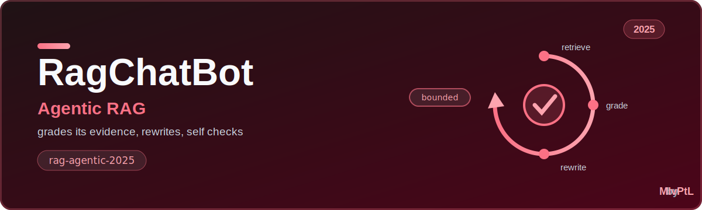
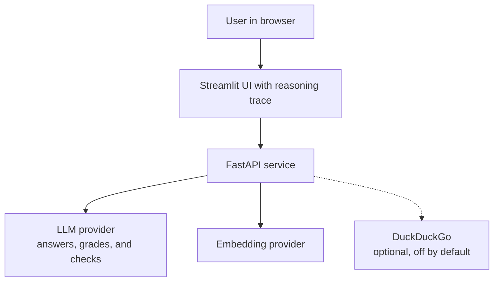
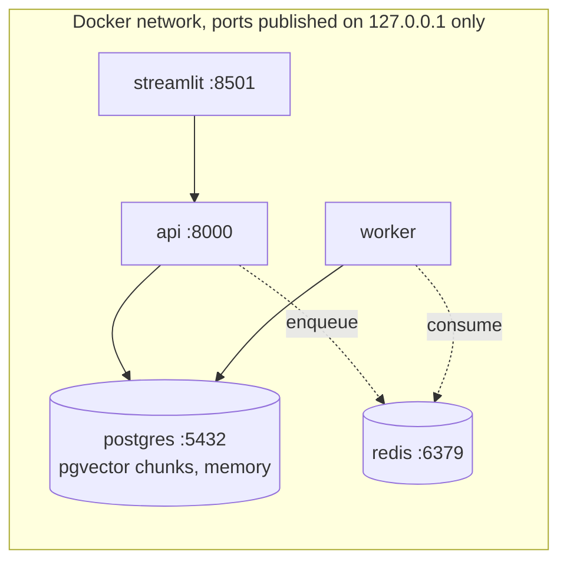
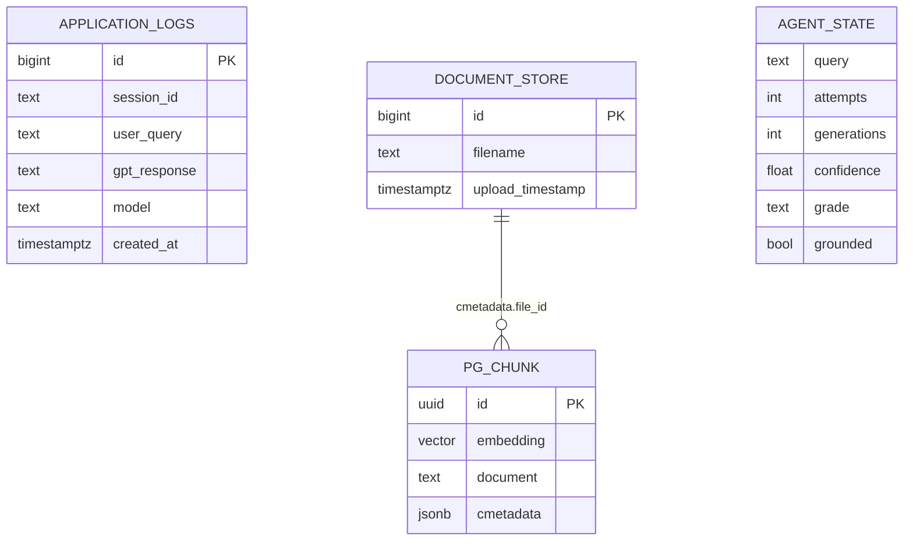
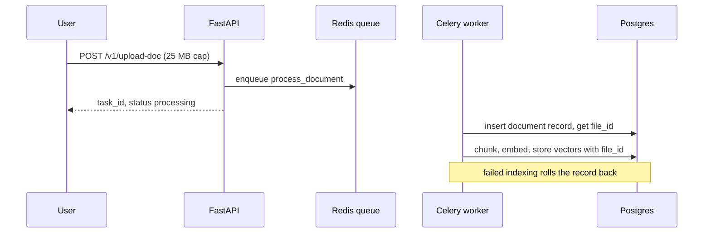
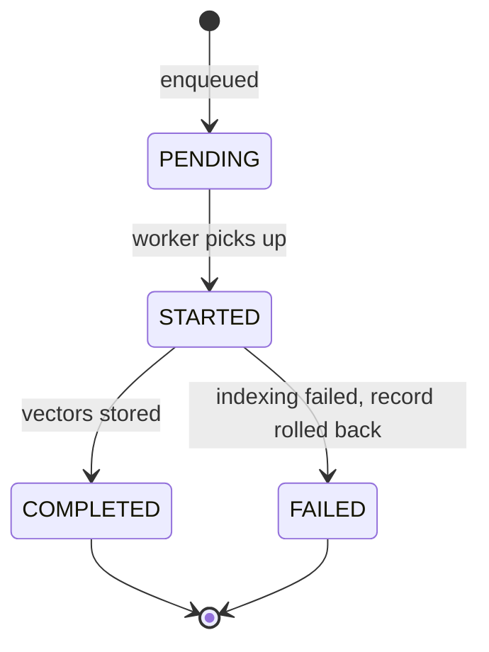
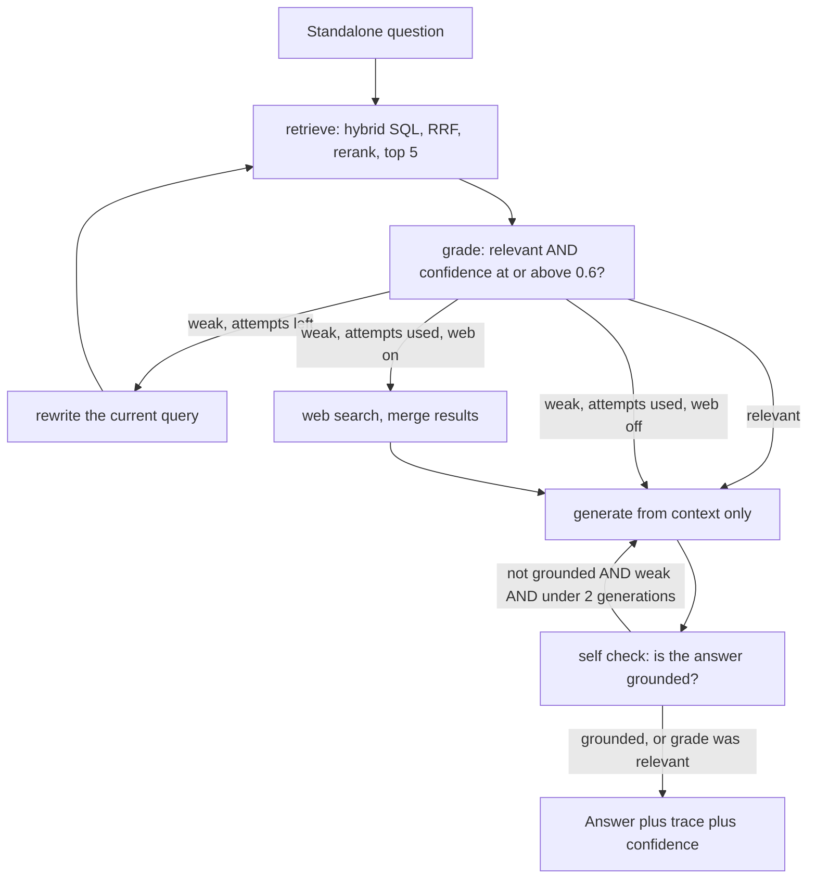
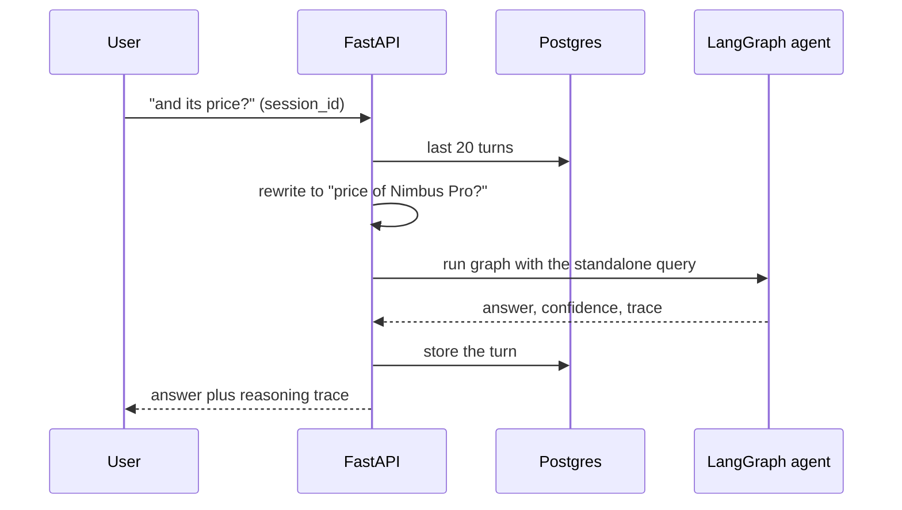

# rag-agentic-2025

**A self correcting, confidence gated agentic RAG: a bounded LangGraph loop that grades its own evidence, rewrites the query when the evidence is weak, and self checks the answer for grounding. The Agentic (2025) rung of the RAG line.**

Part of the RAG line, a series of reference enterprise RAG implementations, one per retrieval strategy. This repository is the Agentic (2025) rung. See [the full line](#the-rag-line) below.

[](https://github.com/mlvpatel/rag-agentic-2025/actions/workflows/ci.yml)    



## Contents

- [What makes it agentic](#what-makes-it-agentic)
- [Tech stack](#tech-stack)
- [Architecture](#architecture)
- [Data model](#data-model)
- [How ingestion works](#how-ingestion-works)
- [How a question is answered](#how-a-question-is-answered)
- [Memory](#memory)
- [The mathematics](#the-mathematics)
- [How to use](#how-to-use)
- [Configuration](#configuration)
- [API reference](#api-reference)
- [A note on access](#a-note-on-access)
- [Testing](#testing)
- [Project structure](#project-structure)
- [The RAG line](#the-rag-line)

## What makes it agentic

Every earlier rung answers in one shot: retrieve once, generate once, hope the retrieval was good. This rung notices when it was not. The engine follows the planning patterns of a real agent, each mapped to a node in a bounded graph:

| Planning pattern | In rag-agentic-2025 |
|---|---|
| ReAct loop, thought, action, observation | retrieve (action), grade (observation), decide (thought) |
| Plan validation | a grader scores whether the retrieved context can answer the question, with a confidence value |
| Replanning | when the grade is weak, the query is rewritten and retrieval runs again |
| Backtracking | after bounded retries, an optional grounded first web fallback, then generate |
| Self correction | the answer is self checked for grounding and regenerated once if it is not grounded |
| Execution tracking | every step is recorded in a trace returned with the answer |

Every branch is bounded, so the loop always terminates. That is the cost guard: a hard limit on retries, regenerations, and total steps.

One honest note on refusal: there is no structural decline branch. When the evidence stays weak after the bounded retries, the agent still generates, under a prompt that instructs it to say it does not have the information. The graded weak trace is returned with the answer, so a caller can see exactly how much the evidence was trusted.

## Tech stack

| Component | Choice | Why this one |
|---|---|---|
| Agent runtime | LangGraph | A state machine with explicit edges is auditable; a free-form agent loop is not |
| API | FastAPI | Async, typed, OpenAPI for free |
| Vector store | pgvector on Postgres 16 | Chunks and memory in one database |
| Sparse retrieval | Postgres full text (ts_rank) | Computed inside the database |
| Fusion | RRF in one SQL query | Rank based, no score calibration |
| Reranker | BAAI/bge-reranker-v2-m3 | Strong multilingual cross encoder, lazy loaded |
| Grader and checker | The same chat model at temperature 0 | Deterministic JSON verdicts, no second model to deploy |
| Web fallback | DuckDuckGo via ddgs, off by default | Keyless, and grounded first means off until turned on |
| Embeddings | Google gemini-embedding-001 or Ollama nomic-embed-text | Ollama for a fully local run |
| Memory | Postgres | Windowed history, reformulation before the graph |
| Ingestion | Celery + Redis | Async indexing |
| UI | Streamlit | Chat surface with the reasoning trace |
| CI | GitHub Actions | Lint, unit tests, pip-audit with no suppressions |

## Architecture

System context:



Containers:



## Data model



`AGENT_STATE` is transient, it lives only inside one graph run, but it is the data model that matters most here: the bounds (`attempts`, `generations`) are state, which is what makes them enforceable.

## How ingestion works



Task lifecycle:



## How a question is answered

The graph, exactly as compiled:



The self check deliberately trusts strong retrieval: when the grade was relevant, a noisy verdict from a small local model does not trigger a needless regeneration. Regeneration happens only in the weak-evidence corner where it can actually help.

## Memory

Turns are stored per `session_id` in Postgres, windowed to the last 20 turns. With history present the question is rewritten to be standalone before the graph starts, and the standalone query drives every node: retrieval, grading, rewriting, and generation. A follow-up pronoun never reaches the grader.



## The mathematics

**The confidence gate.** The grader returns JSON with a boolean and a confidence $c \in [0, 1]$; the evidence counts as relevant only when

$$\text{relevant} \;\wedge\; c \geq \tau, \qquad \tau = 0.6$$

Both conditions matter: a model that says "relevant, confidence 0.3" is hedging, and the gate treats hedging as weak. The threshold trades retrieval retries against acceptance of mediocre context; raising it makes the agent stricter and slower.

**Termination, provable from the bounds.** Let $a \leq A = 2$ be retrieval attempts, $g < G = 2$ generations, and $s \leq S = 12$ total steps (the LangGraph recursion limit). Every cycle in the graph strictly increases one of these counters, and every counter has a hard bound, so the number of node executions is bounded by

$$s \;\leq\; \min\big(S,\; 2A + G + 3\big)$$

The loop cannot run away, which is the difference between an agent you can bill for and one you cannot.

**Retrieval, inherited from the line.** Dense pgvector cosine distance and sparse `ts_rank` are fused in one SQL query with Reciprocal Rank Fusion over 1-based ranks:

$$\text{RRF}(d) = \frac{1}{k + r_{\text{dense}}} + \frac{1}{k + r_{\text{sparse}}}, \qquad k = 60$$

with a pool of 20 per channel, then a cross encoder $s(q, d) = g([q\,;\,d])$ keeps the top 5. Agreement between channels outranks one channel's enthusiasm, and the reranker buys accuracy exactly where the candidate set is small enough to afford it.

**Why grading is cheap insurance.** One extra model call per question (the grade) buys the ability to detect a failed retrieval before generating from it. The expected cost of the loop is

$$c_{\text{grade}} + c_{\text{gen}} + p_{\text{weak}} \cdot \big(c_{\text{rewrite}} + c_{\text{retrieve}} + c_{\text{grade}}\big) + p_{\text{regen}} \cdot c_{\text{gen}}$$

where $p_{\text{weak}}$ is the weak-grade rate. For corpora where retrieval mostly works, $p_{\text{weak}}$ is small and the agent costs one grade more than naive RAG; where retrieval struggles, the loop spends its budget exactly on the questions that need it.

## How to use

### Local, fully offline with Ollama (no paid keys)

```bash
# 1. Data services
make db-up             # postgres with pgvector, plus redis

# 2. Ollama and the local models
ollama serve &
ollama pull nomic-embed-text
ollama pull llama3.2:3b

# 3. Install and run
make install
EMBEDDING_PROVIDER=ollama make dev        # API on :8000
make frontend                             # UI on :8501, second terminal
```

Select the llama3.2:3b model, ask a question, and open the reasoning trace under the answer to watch the agent correct itself.

### Try it with the bundled sample data

The repo ships sample documents in [sample_data](sample_data), an HR handbook, a product FAQ, and a real SEC 10-K excerpt. With the stack up:

```bash
make load-samples
```

Then ask the questions in [sample_data/README.md](sample_data/README.md), including an honesty check where the agent should say it does not have the information rather than guess.

## Configuration

| Setting | Default | Meaning |
|---|---|---|
| EMBEDDING_PROVIDER | google | google or ollama |
| AGENT_CONFIDENCE_THRESHOLD | 0.6 | A grade at or above this counts as relevant |
| AGENT_MAX_RETRIEVAL_ATTEMPTS | 2 | Bounded rewrite and retry attempts |
| AGENT_ENABLE_WEB | false | Grounded first; turn on to allow the web fallback |
| AGENT_MAX_STEPS | 12 | Hard cap on total graph steps |
| TOP_K / RERANKER_TOP_N | 5 / 5 | Final chunk counts per stage |
| MAX_UPLOAD_MB | 25 | Uploads rejected above this size |
| ALLOWED_ORIGINS | http://localhost:8501 | CORS allowlist |

## API reference

| Method and path | Purpose | Limit |
|---|---|---|
| GET /health | Liveness | none |
| GET /metrics | Prometheus metrics | none |
| POST /v1/chat | Agentic answer with reasoning trace and confidence | 60/min |
| POST /v1/upload-doc | Upload, queue async indexing | 10/min, 25 MB |
| GET /v1/task/{task_id} | Poll indexing status | none |
| GET /v1/list-docs | List indexed documents | none |
| POST /v1/delete-doc | Delete a document and its chunks | none |

## A note on access

The service has no authentication, and that is a decision rather than an omission. It is a reference implementation meant to run on one machine: docker compose binds every published port, Postgres and Redis included, to `127.0.0.1`, and the containers run as a non-root user. A shipped default credential would be the worse option, since it reads as protection while sitting in a public repository. What remains is real: per route rate limiting, a hard size cap on uploads, HTML stripping on every question, and a narrow CORS origin. Put an authenticating gateway in front before exposing any of it beyond loopback.

## Testing

```bash
make test        # unit tests, no database or model needed
```

Unit tests cover every routing branch of the graph (relevant to generate, weak with retries to rewrite, exhausted to generate, grounded to end, ungrounded weak to one regeneration), that the standalone query drives retrieval, grading, rewriting, and generation (a follow-up pronoun must never reach the grader), that the rewriter iterates from the current query rather than the original, the windowed history query, and the API contract without credentials. Integration tests run the real agent against a live Postgres and Ollama when reachable. A retrieval evaluation harness lives in [eval](eval).

## Project structure

```
src/agent/        the agentic graph: state, nodes, tools, graph
src/api/          FastAPI app, endpoints, Postgres memory
src/core/         config, chain helpers, logging
src/embeddings/   pgvector store and embedding providers
src/retrieval/    hybrid retriever and reranker
src/worker/       Celery app and the indexing task
eval/             golden questions and retrieval metrics
frontend/         Streamlit UI with the reasoning trace
sample_data/      runnable sample documents
tests/            unit and integration tests
docker/           Dockerfile and Compose stack
```

## The RAG line

This repo is the Agentic (2025) rung. Each rung adds one idea and keeps the ones below it.

| Year | Repository | Strategy |
|---|---|---|
| 2022 | [rag-naive-2022](https://github.com/mlvpatel/rag-naive-2022) | Naive: one dense search over Chroma |
| 2023 | [rag-advanced-2023](https://github.com/mlvpatel/rag-advanced-2023) | Advanced: hybrid, RRF and cross encoder, in Python |
| 2023 | [rag-modular-2023](https://github.com/mlvpatel/rag-modular-2023) | Modular: pgvector, RRF in SQL, streaming, memory, evaluation |
| 2024 | [rag-graph-2024](https://github.com/mlvpatel/rag-graph-2024) | Graph: entity and triple knowledge graph linked into answers |
| 2024 | [rag-cache-2024](https://github.com/mlvpatel/rag-cache-2024) | Cache: no retrieval, corpus in context with a semantic cache |
| 2025 | rag-agentic-2025, this repo | Agentic: bounded self correcting loop, confidence gated |
| 2026 | [rag-multiagent-2026](https://github.com/mlvpatel/rag-multiagent-2026) | Multi agent: supervisor, specialists, verifier |
| 2026 | [rag-multimodal-2026](https://github.com/mlvpatel/rag-multimodal-2026) | Multimodal: text and images in one vector space |

## Author

Malav Patel. GitHub [@mlvpatel](https://github.com/mlvpatel).

## License

Released under the MIT License. See [LICENSE](LICENSE).
