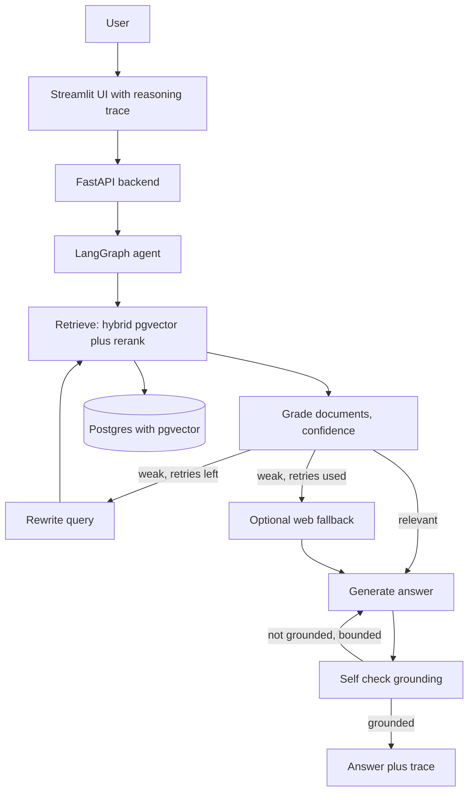

# RagFlowProPlus

**A self correcting, confidence gated agentic RAG. Part of the RagFlow line.**

**Part of the RagFlow line, a series of reference enterprise RAG implementations. This repository is RagFlowProPlus, Agentic RAG.** See [the full line](#the-ragflow-line) below.

RagFlowProPlus does not answer in one shot. It plans, retrieves, grades its own evidence, rewrites the query and retrieves again when the evidence is weak, and verifies the answer is grounded before returning it. The loop is a bounded LangGraph state machine on top of the RagFlowPro backbone (Postgres and pgvector hybrid retrieval, a cross encoder reranker), and it runs fully locally on Ollama at no cost.

[](https://github.com/mlvpatel/RagFlowProPlus/actions/workflows/ci.yml)    


The clip above is a live, unedited run on a local qwen2.5 model over pgvector. The expandable trace shows the agent retrieve, grade, generate, and self check, with a confidence score. A full resolution screenshot is at [assets/screenshots/ragflowproplus-ui.png](assets/screenshots/ragflowproplus-ui.png). No paid keys were used.

## What makes it agentic

The engine follows the planning patterns of a real agent, each mapped to a node in a bounded graph:

| Planning pattern | In RagFlowProPlus |
|---|---|
| ReAct loop, thought, action, observation | retrieve (action), grade (observation), decide (thought) |
| Plan validation | a grader scores whether the retrieved context can answer the question, with a confidence value |
| Replanning | when the grade is weak, the query is rewritten and retrieval runs again |
| Backtracking | after bounded retries, an optional grounded first web fallback, then answer honestly |
| Self correction | the answer is self checked for grounding and regenerated once if it is not grounded |
| Execution tracking | every step is recorded in a trace returned with the answer |

Every branch is bounded, so the loop always terminates. That is the cost guard: a hard limit on retries, regenerations, and total steps.

## How a question is answered

The agent retrieves, then grades the evidence. If the grade is relevant it generates and self checks. If the grade is weak it rewrites the query and retrieves again, up to a bounded number of attempts, then optionally falls back to web search, then generates. Every branch is bounded, so the loop always terminates.

On a question the documents do not cover, the agent grades the evidence weak, rewrites and retries within its bounded budget, then answers honestly that it does not have the information rather than inventing one.

## Features

| Area | Capability |
|---|---|
| Agent | Bounded self correcting LangGraph loop: retrieve, grade, rewrite, web fallback, generate, self check |
| Confidence | LLM grader with a confidence threshold gate, no trained model needed |
| Retrieval | Dense pgvector plus sparse Postgres full text, fused with RRF in one SQL query |
| Reranking | Cross encoder bge-reranker-v2-m3 |
| Models | OpenAI, Anthropic, or local Ollama, chosen by model name |
| Grounded first | Answers strictly from your documents; the web fallback is off by default |
| Observability | The full reasoning trace is returned and shown in the UI |
| Memory | Multi turn sessions stored in Postgres |
| Security | API key auth, rate limiting, input sanitization, CORS |
| Packaging | Docker Compose, Prometheus metrics, tests, CI |

## Architecture



## How to use

### Local, fully offline with Ollama (no paid keys)

```bash
# 1. Data services
make db-up             # postgres with pgvector, plus redis

# 2. Ollama and the local models
ollama serve &
ollama pull nomic-embed-text
ollama pull llama3.2:3b

# 3. Install and run
make install
EMBEDDING_PROVIDER=ollama make dev        # API on :8000
make frontend                             # UI on :8501, second terminal
```

Select the llama3.2:3b model, ask a question, and open the reasoning trace under the answer to watch the agent correct itself.

## Try it with the bundled sample data

The repo ships sample documents in [sample_data](sample_data), an HR handbook, a product FAQ, and a real SEC 10-K excerpt. With the stack up:

```bash
make load-samples
```

Then ask the questions in [sample_data/README.md](sample_data/README.md), including an honesty check where the agent should decline rather than guess.

## Configuration

| Setting | Default | Meaning |
|---|---|---|
| EMBEDDING_PROVIDER | google | google or ollama |
| AGENT_CONFIDENCE_THRESHOLD | 0.6 | a grade at or above this counts as relevant |
| AGENT_MAX_RETRIEVAL_ATTEMPTS | 2 | bounded rewrite and retry attempts |
| AGENT_ENABLE_WEB | false | grounded first; turn on to allow the web fallback |
| AGENT_MAX_STEPS | 12 | hard cap on total graph steps |
| API_KEY | change_me | required in the X-API-Key header |

## API reference

| Method and path | Purpose |
|---|---|
| GET /health | Liveness, no auth |
| POST /v1/chat | Agentic answer with the reasoning trace and confidence |
| POST /v1/upload-doc | Upload and asynchronously index a document |
| GET /v1/list-docs | List indexed documents |
| POST /v1/delete-doc | Delete a document and its chunks |
| GET /metrics | Prometheus metrics |

## Testing

```bash
make test        # unit tests, no database or model needed
```

Unit tests cover the agent routing logic, the parsing, and the API contract, with the model and database mocked. Integration tests run against the live stack.

## Project structure

```
src/agent/        the agentic graph: state, nodes, tools, graph
src/api/          FastAPI app, endpoints, security, Postgres memory
src/core/         config, retrieval chain helpers, logging
src/embeddings/   pgvector store and embedding providers
src/retrieval/    hybrid retriever and reranker
frontend/         Streamlit UI with the reasoning trace
sample_data/      runnable sample documents
tests/            unit and integration tests
docker/           Dockerfile and Compose stack
```

## The RagFlow line

RagFlowProPlus is one implementation in the RagFlow line, a series demonstrating distinct enterprise RAG retrieval strategies.

| Year | Repository | Generation |
|---|---|---|
| 2022 | [RagFlow](https://github.com/mlvpatel/RagFlow) | Naive RAG, single dense retrieval |
| 2023 | [RagFlowPlus](https://github.com/mlvpatel/RagFlowPlus) | Advanced RAG, hybrid retrieval and reranking |
| 2024 | [RagFlowPro](https://github.com/mlvpatel/RagFlowPro) | Modular production RAG, pgvector, streaming, evaluation |
| 2025 | RagFlowProPlus, this repo | Agentic RAG, self correcting with confidence grading |
| 2026 | [RagFlowProMax](https://github.com/mlvpatel/RagFlowProMax), UltimateRAG | Multi agent enterprise, multimodal |

Every implementation is measured on the same golden questions, keyless, in the [rag-catalog](https://github.com/mlvpatel/rag-catalog) hub.

## Author

Malav Patel. GitHub @mlvpatel.

## License

Released under the MIT License. See [LICENSE](LICENSE). MIT is the simplest and most permissive of the common licenses, so anyone can read, run, modify, and reuse the code freely.
